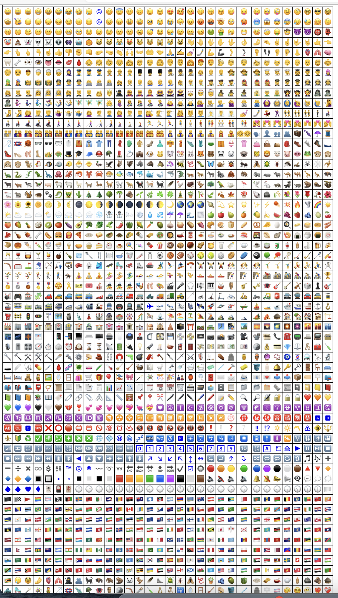
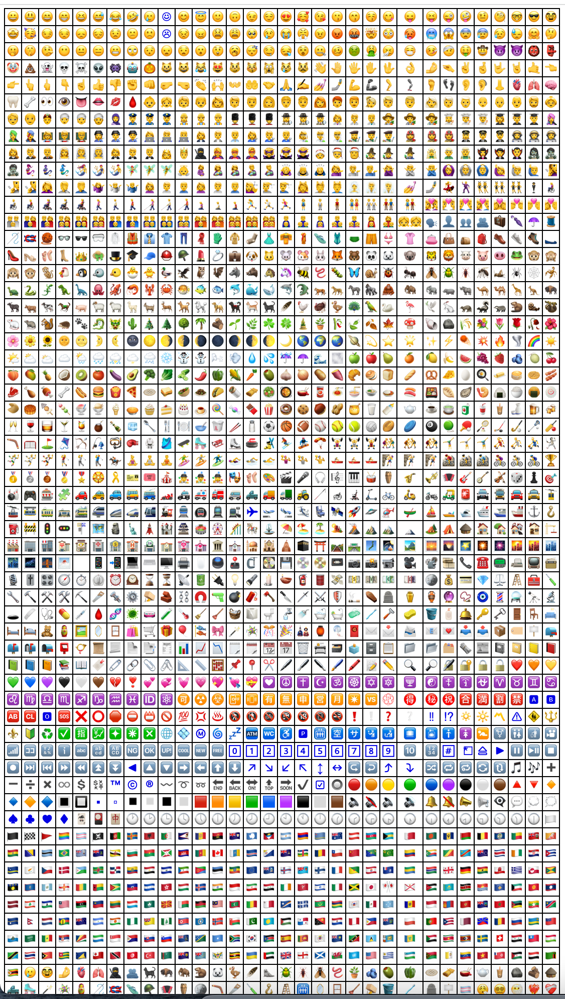

# emoji fallback test

default font stack
```css
font-family: ... , "Apple Color Emoji", "Segoe UI Emoji", "Segoe UI Symbol";
```

with twemoji font stack as fallback (only displaying when apple emoji is not available)
```css
font-family: ... , "Apple Color Emoji", twemoji, "Segoe UI Emoji", "Segoe UI Symbol";
```

## test results using twemoji font stack option

| Mac – Safari <br/>15.2 (17612.3.6.1.6) | Mac – Edge <br/>96.0.1054.62 (Official build) (arm64) |
| ---- | ---- |
|  |  |

| Mac – Chrome <br/>96.0.4664.110 (Official Build) (arm64) | Mac – Firefox <br/>???? |
| ---- | ---- |
|  | ???? |

TODO:
* mac
    * firefox
* windows
    * edge
    * edge + internet explorer legacy mode
    * chrome
    * firefox
* ios
    * safari
    * chrome
* android
    * chrome
    * samsung internet
